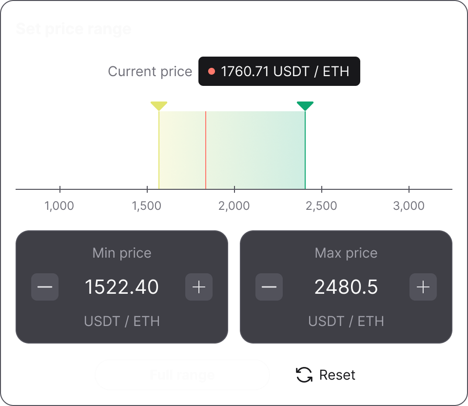

# Concentrated Liquidity

### Introduction

XpandX introduces a key innovation that allows users to concentrate their liquidity within specific price ranges. Unlike traditional decentralized exchanges that evenly distribute liquidity across the entire price curve from 0 to infinity, XpandX enables users to focus their liquidity where it is most needed.

In existing AMM protocols, a significant portion of the liquidity remains untouched and unused in the pools. This means that the liquidity provided is not fully utilized, resulting in wasted potential. For example, in stablecoin trading pools, where the trading price is usually fixed, the liquidity outside the regular price range is rarely used. In fact, less than 1% of the total liquidity in mainstream stablecoin trading pools is actually utilized, while the remaining liquidity remains idle.

Liquidity providers naturally expect their provided liquidity to be maximally utilized so that they can earn more fees. XpandX addresses this by introducing the concept of concentrated liquidity. Liquidity providers can concentrate their liquidity within specific price ranges that correspond to the most active trading intervals for a particular trading pair. By doing so, they can optimize their liquidity efficiency and earn higher fees.

Concentrated liquidity transforms the previously infinite price interval of a user's liquidity into a finite range. This concentrated liquidity is referred to as a "position" or a "liquidity position." Liquidity providers have the flexibility to create multiple positions within the same pool, allowing them to simulate different price curves and implement custom strategies based on their desired price ranges.

### Active Liquidity

When a user sets a specific price range for their position, it means that their liquidity will only be active and earning fees as long as the asset price stays within that range. However, if the market experiences fluctuations and the price moves outside of the set range, the liquidity in that position will become inactive and stop earning fees until the price returns to the desired range.

When the price of a trading pair goes up or down, liquidity providers will benefit from having more of the token that is in higher demand from swappers. As the price reaches the upper or lower limit of their positions, their entire liquidity will consist of only one type of asset.

Once the price re-enters the specified range, the liquidity within the position becomes active again and starts earning fees. At this point, the liquidity composition within an active position will include both tokens instead of just one.

Concentrated liquidity provides liquidity providers with great flexibility. They can create multiple liquidity positions with custom price ranges as they see fit. The underlying algorithm of concentrated liquidity ensures that the decision on liquidity distribution is left to the market itself. Most liquidity providers naturally concentrate their liquidity within the most active price ranges based on market trends, as it allows them to earn higher transaction fees.

### &#x20;Price intervals

In a regular automated market maker (AMM) system, the price is continuous and can change smoothly. However, in a concentrated liquidity protocol, the prices are divided into specific points called ticks (or price intervals). Each tick represents a small percentage change in price.

Ticks act as borders for liquidity positions. When liquidity providers set up a position, they choose specific upper and lower ticks to define the price range.

As trades happen and the price fluctuates, the protocol uses up the available liquidity within the current tick range. It keeps exchanging assets until the price reaches the next tick. At that point, the protocol switches to the new tick, and any unused liquidity within that tick range becomes active.

In a concentrated liquidity protocol, not all ticks are active. The spacing between ticks depends on the swap fee tier. Lower fee tiers allow for smaller spacing between active ticks, while higher fee tiers have larger spacing.

For trading pairs that require more precise pricing, like stablecoin pairs, having narrower tick spacing is beneficial. It helps reduce the impact on prices during swaps, which is important for stablecoin pools.

